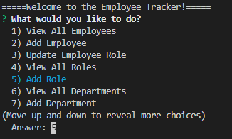

# Project Title : CMS Employee Tracker
## Project Description:
The purpose of this project is to architect and build a content management system using node, Inquirer and SQL. This content management system is designed for a business owner to manage the company's employees.

The CMS working functionalities are:
*View all employees
*View all roles
*View all departments

The other functionalities in the Employee Tracker Menu are under development.

